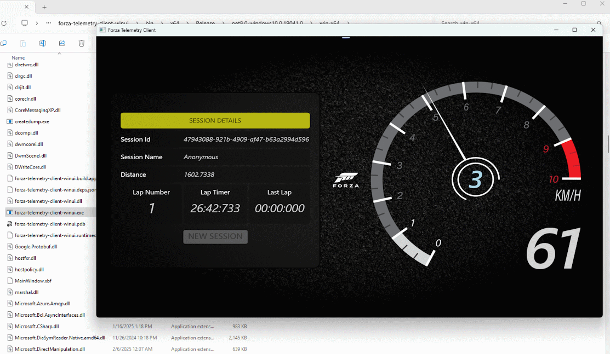

# forza-telemetry-client
Client Application with bridge from Forza Motorsports to Azure Event Hubs and Fabric Event Streams



## Build Requirements
* [Git](https://git-scm.com/)
  * Note: This repo provides additional source dependencies via [git submodule](https://git-scm.com/docs/gitsubmodules)
* [Visual Studio 2022 17.4 or later](https://visualstudio.microsoft.com/#vs-section)
  * See: [Start developing Windows apps](https://learn.microsoft.com/en-us/windows/apps/get-started/start-here?tabs=vs-2022-17-10)
  * Packaged and Unpackaged build configurations are provided in the solution, Releases are distributed as Unpackaged for ease of portability, see: [Advantages and disadvantages of packaging your app](https://learn.microsoft.com/en-us/windows/apps/package-and-deploy/#advantages-and-disadvantages-of-packaging-your-app)

 ## Building from Source in Visual Studio
 ``` 
 git clone https://github.com/toolboc/forza-telemetry-client.git
 cd ./forza-telemetry-client
 git submodule init
 git submodule update
 start devenv .
 ```
Select your desired configuration and Build!

## Runtime Requirements
* Windows 10
  * Currently targeting Frameworks 10.0.17763.0 - 10.0.19041.0
* Azure Event Hub
  * See: [Steps to deploy an Azure Event Hub using Azure Portal](https://learn.microsoft.com/en-us/azure/event-hubs/event-hubs-create)

## Usage
 * Download and extract [latest release](https://github.com/toolboc/forza-telemetry-client/releases)
 * Modify [config/appsettings.json](https://github.com/toolboc/forza-telemetry-client/blob/main/forza-telemetry-client-winui/config/appsettings.json)
   *  Provide values for *[eventHubConnectionString](https://learn.microsoft.com/en-us/azure/event-hubs/event-hubs-get-connection-string)*, *[namespace](https://learn.microsoft.com/en-us/azure/event-hubs/event-hubs-create#create-an-event-hubs-namespace)*, and *[eventHubName](https://learn.microsoft.com/en-us/azure/event-hubs/event-hubs-create#create-an-event-hub)*
 * Run the Desktop application, *forza-telemetry-client-winui.exe*, if prompted by Windows Defender SmartScreen, Click "More Info" => "Run anyway"
 * Launch Forza Motorsport on Xbox or PC, start race and enter *SETTINGS* => *GAMEPLAY & HUD*, set *Data Out* to *On*, set *Data Out IP Address* to the ip address of the machine runing the Desktop Application, set *Data Out IP Port* to 5300, and set *Data Out Packet Format* to *Car Dash*, exit and return to the race, when you accelerate you should see the RPM needle move up and down in the Desktop Application

## Releases and Versioning

This project uses [semantic versioning](https://semver.org/) with automated releases via GitHub Actions. 

* **Stable releases** are available on the [Releases page](https://github.com/cmaneu/forza-telemetry-client/releases)
* **Version management** is documented in [docs/VERSIONING.md](docs/VERSIONING.md)
* **Release workflow** automatically creates releases when manually triggered

### Creating a New Release

1. Update the version in `forza-telemetry-client-winui/forza-telemetry-client-winui.csproj`
2. Use the GitHub Actions "GitHub Release Publisher" workflow to create the release
3. The workflow will automatically build, package, and publish the release

For more details, see the [versioning documentation](docs/VERSIONING.md).

 ## Troubleshooting
* The app fails to launch: Most likely a misconfiguration in [config/appsettings.json](https://github.com/toolboc/forza-telemetry-client/blob/main/forza-telemetry-client-winui/config/appsettings.json)
* The app launches but I do not seem to be receiving data from Forza Motorsport: Confirm that the port configuration in [config/appsettings.json](https://github.com/toolboc/forza-telemetry-client/blob/main/forza-telemetry-client-winui/config/appsettings.json) is not blocked on your device